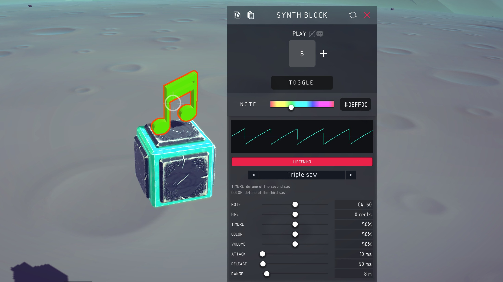
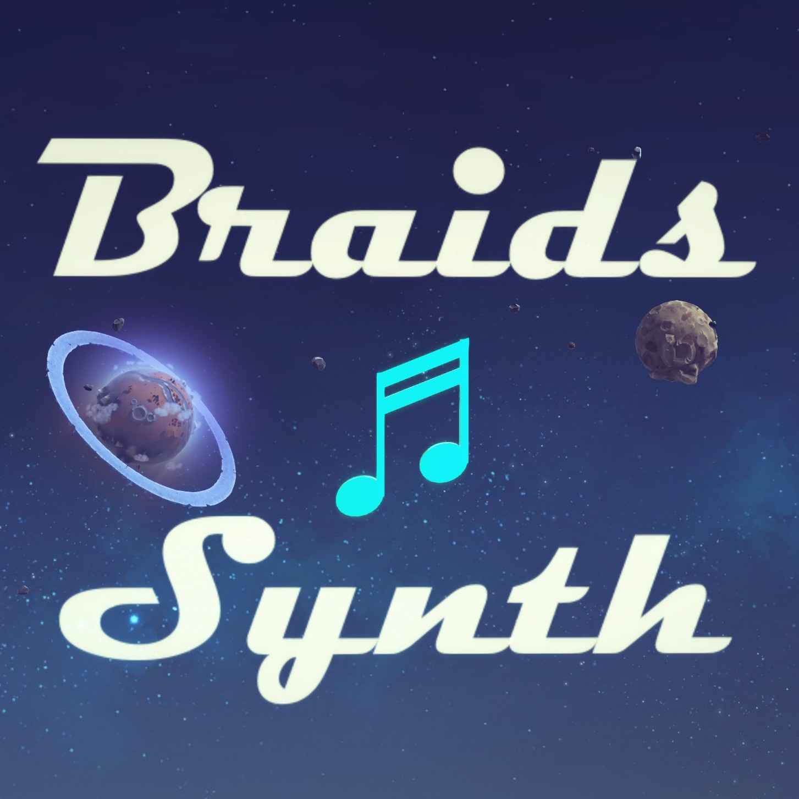

# Besiege Braids Synth

A macro-oscillator block, in [Besiege](https://store.steampowered.com/app/346010/Besiege/).



A port of [Braids](https://github.com/pichenettes/eurorack/tree/master/braids),
Mutable Instruments' eurorack macro-oscillator. Not a sample player: the block
synthesises every sample as the machine runs, so pitch and timbre can be driven
while it plays.

Sixteen of Braids' models are here, and all sixteen render **sample for sample
identically to Braids' own C++** — see [Fidelity](#fidelity).

**Requires [UI Factory](https://steamcommunity.com/sharedfiles/filedetails/?id=2913469777)**
(another Besiege mod which enables the nice UI, see workshop item `2913469777`) or the block cannot be set up.

## Install

Either subscribe to the mod on Steam, or if you don't use Steam you can clone the repo then:

```sh
./tools/install.sh              # symlink into Besiege_Data/Mods
./tools/install.sh --copy       # copy instead
./tools/install.sh --uninstall
```

Set `BESIEGE_DIR` if your install isn't found automatically. Start Besiege, enable
**Braids** in the mods menu, and the Synth Block appears in the block toolbar —
search `synth block`, `braids` or `oscillator`. No C# toolchain is needed; the
build uses Besiege's own compiler.

## The block



The block is a musical note. It lights up while the block is sounding, in a colour
off the **Note** slider on Besiege's own block mapper — so a machine full of them
shows you which ones are playing.

## The panel

The panel docks under Besiege's own block mapper, the same width as it, so the two
read as one window. It scrolls, since there is more in it than fits beside a
machine, and it goes when the mapper goes.

- **A live trace of the block's own output.** Twenty-three models and two controls
  that mean something different under each of them: the fastest way to find out
  what a control does is to watch it.
- **The model dropdown**, Braids' own sixteen and then the plain waveforms, with
  an arrow either side for stepping through them one at a time.
- **What TIMBRE and COLOR do in the model you picked**, in words, because in Braids
  they never mean the same thing twice.
- **LISTEN**, which sounds the block while the machine is still being built, so a
  model can be chosen by ear rather than by name.
- **Every dial**: NOTE and FINE, TIMBRE and COLOR, VOLUME, ATTACK and RELEASE, and
  RANGE. Drag them, or click the value and type it — including NOTE, which takes
  either a name (`C4`, `F#2`, `Bb3`) or a MIDI number. A click selects what is in
  the box; a second click puts the caret where you clicked.

Everything on the panel is one of the block's own mapper settings, hidden from the
mapper rather than kept apart from it, so the machine saves exactly as before.

## Options

On Besiege's block mapper:

| Setting | What it does |
| --- | --- |
| Play | Key that opens the gate. Default `B`. Takes a variable in place of a key, like any other block's |
| Toggle | On, the key starts and stops. Off, it plays while held |
| Note | What colour the note inside the block lights while it sounds |

On the panel:

| Setting | What it does |
| --- | --- |
| Model | Which of the twenty-three |
| Note | Pitch, as a MIDI note number |
| Fine | ±100 cents against that |
| Timbre | Braids' TIMBRE. Means whatever the model decides |
| Color | Braids' COLOR, likewise |
| Volume | 0 to 1 |
| Attack | How long the gate takes to open, in seconds. The slider covers 0–2 s; type for up to 600 |
| Release | And to close. The slider covers 0–4 s; type for up to 600 |
| Range | How far the block carries, in metres. Full volume within it, then falling away as 1/distance — so turning it up makes the block louder at any distance as well as audible from further off. The slider covers 1–100 m; type for up to 100000 |

## Models

Braids' own sixteen, in Braids' order:

**CSaw**, **Morph**, **Saw square**, **Sine triangle**, **Buzz**, **Square sub**,
**Saw sub**, **Square sync**, **Saw sync**, **Triple saw**, **Triple square**,
**Triple triangle**, **Triple sine**, **Triple ring mod**, **Saw swarm**,
**Saw comb**.

Then the analog oscillator on its own, which is not something Braids offers but is
the obvious thing to want from a block that makes a note: **Saw**, **Variable
saw**, **Square**, **Triangle**, **Sine**, **Triangle fold**, **Sine fold**.

What is not here is the rest of `digital_oscillator.cc` — FM, the physical models,
the noise models, the wavetables. See [CHANGELOG.md](CHANGELOG.md).

## Fidelity

`./tools/compare-reference.sh` fetches [Braids' own source](https://github.com/pichenettes/eurorack/tree/master/braids),
builds it, and renders every model through both it and this port at 96 kHz. All
sixteen agree on every sample, over the whole range of both controls at four
pitches.

Two patches are applied to Braids' source to make that comparison possible, and
neither changes what it computes: `previous_shape_` and the comb's delay line are
never initialised in the original, so what the first block renders depends on
uninitialised memory. The harness gives them defined values — the ones this port
uses.

Everything Braids ships as a generated table is rebuilt here from the formulas in
its `resources.py` rather than embedded, and each one reproduces the shipped array
exactly. The two exceptions are `wav_sine` and the fifteen band-limited comb
tables, which `resources.py` runs a second-order dither over; the closed forms
land within 2 counts of 32766, and the comparison swaps them into the reference so
the rest is measured against arithmetic rather than rounding noise.

## Notes

The oscillator runs at Unity's own output rate rather than Braids' 96 kHz, so
there is no resampling stage: every table that depends on a rate is built for
whatever rate the game reports. Everything else is Braids' arithmetic unchanged —
the phase is a 32-bit accumulator, samples are int16, and the BLEP corrections are
the same integer maths. Floating point would round differently and lose the
character.

One thing is deliberately *not* Braids': a DC blocker at the very end. Several
models carry a large offset on purpose — a square at full TIMBRE is a 1% pulse,
which sits near the rail for the rest of its cycle. On the module the output stage
is capacitor-coupled and none of that reaches the outside world. Unity has no such
stage, so the same high-pass goes here.

The block is heard from where it is on the machine: it pans as the camera goes
round and falls away with distance. Doppler is off — a machine at Besiege speeds
would bend a held note by several semitones.

Details land in `Player.log` and in the in-game console with `show_logs true`.

AI agent? see [AGENTS.md](AGENTS.md) for layout, build, and any relevant info.

## Credits

Braids is by Émilie Gillet / [Mutable Instruments](https://github.com/pichenettes/eurorack/tree/master/braids),
MIT licensed; the notice ships in
[BraidsSynth/BraidsSynthScripts/BRAIDS-LICENSE.txt](BraidsSynth/BraidsSynthScripts/BRAIDS-LICENSE.txt).
The panel is built from [UI Factory 3](https://gitlab.com/dagriefaa/ui-factory-3)
by dagriefaa. It docks against the block mapper, and the block's toolbar pose is
set, the way [Orchestra](https://github.com/anton-scholten/Besiege-Orchestra) does
both.
